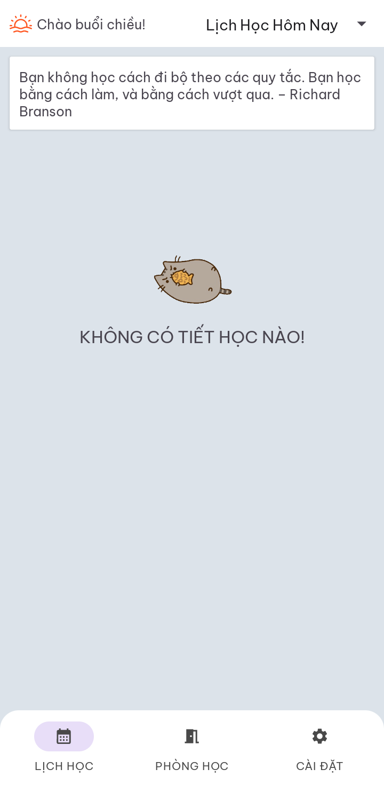
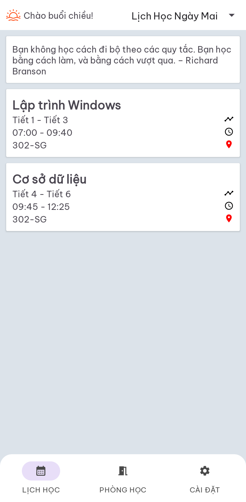
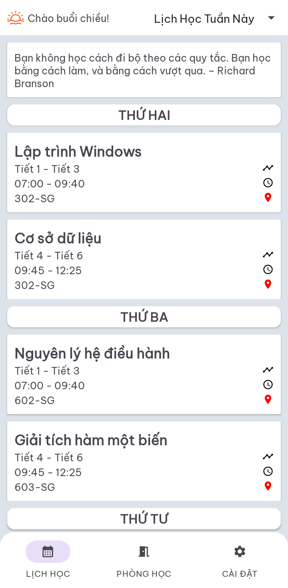
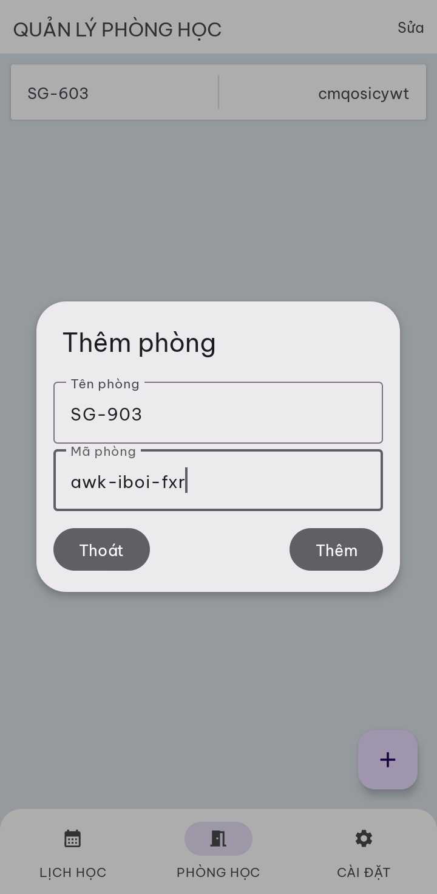
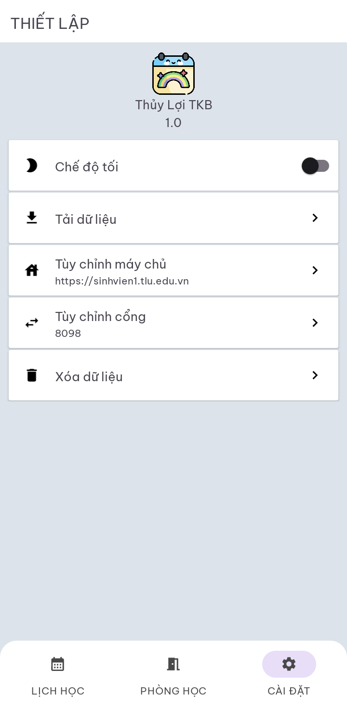

# Thời Khóa Biểu Đại học Thủy Lợi - Thuy Loi University Timetable
Thời Khóa Biểu Đại học Thủy Lợi là ứng dụng Android được xây dựng theo mô hình MVVM và Clean Architecture,sử dụng APIs từ [Trang Sinh Viên Đại Học Thủy Lợi](sinhvien.tlu.edu.vn). Ứng dụng bao gồm các chức năng như: Xem lịch học (hôm nay, ngày mai, cả tuần, toàn bộ học kỳ), Quản lý phòng học (vào phòng học trực tuyến Zoom hoặc Google Meet thông qua ID), Tùy chỉnh địa chỉ máy chủ APIs.

The Thuy Loi University Timetable is an Android application built using the MVVM and Clean Architecture patterns, utilizing APIs from the Thuy Loi University Student Portal. The application includes the following functionalities:

1. View Timetable: Users can check their class schedules for today, tomorrow, the entire week, or the entire semester.

2. Classroom Management: Users can access online classrooms via Zoom or Google Meet using the provided IDs.

3. Custom API Server Address: The application allows users to customize the API server address to connect to the Thuy Loi University Student Portal.
## Preview







## Local setup
Cập nhật dòng sau trong local.properties

Update the following line in local.properties

```properties
host.name=<Địa chỉ máy chủ (bao gồm giao thức) / Server Address (including protocol)>
host.port=<Cổng máy chủ (tìm tại <Địa chỉ máy chủ>/application.js biến Education.PORT) /Server Port (found in <Server Address>/application.js, variable Education.PORT)
app.key_alias=<Khóa bí mật (tự chọn) / Secret Key (user-defined)>
```

## Future Features
* Chế độ tối / Dark Mode.
* Hiển thị lịch học của cả học kỳ / Displaying the schedule for the entire semester.


